

# Typetalk Reminder

Typetalk上で予定のリマインドを行うBOTです。イベントの当日朝9時と開始1時間前に通知してくれます。

## 使い方

[Releases](https://github.com/xryuseix/typetalk_reminder/releases)から最新のindex.jsとtemplate.xlsxをダウンロードしてください。

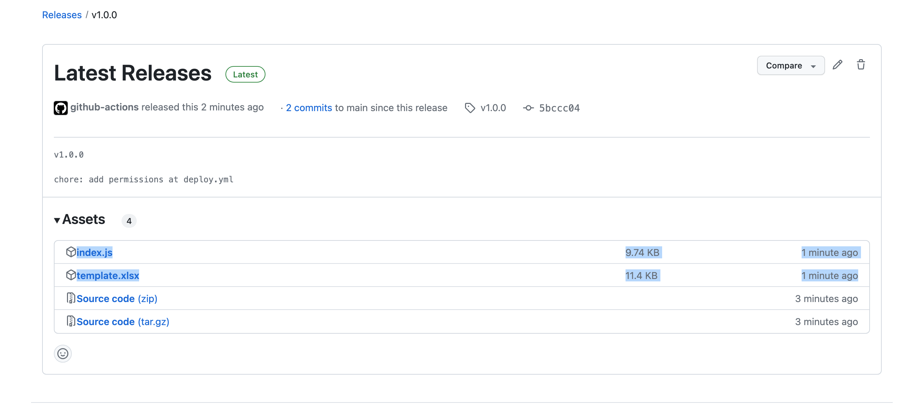

### スプレッドシートの設定

[Google スプレッドシート](https://docs.google.com/spreadsheets/)にて新しいスプレッドシートを作成してください。

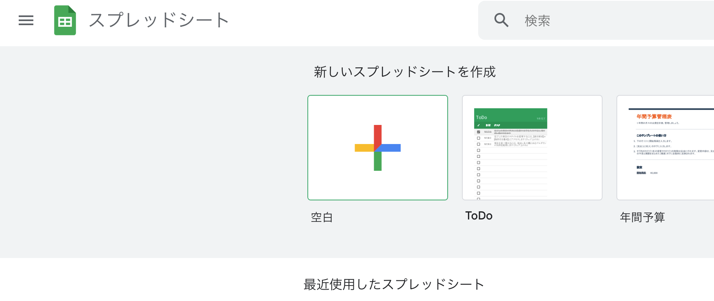

作成したら「ファイル」から「インポート」を選択して、ダウンロードしたtemplate.xlsxをアップロードしてください。

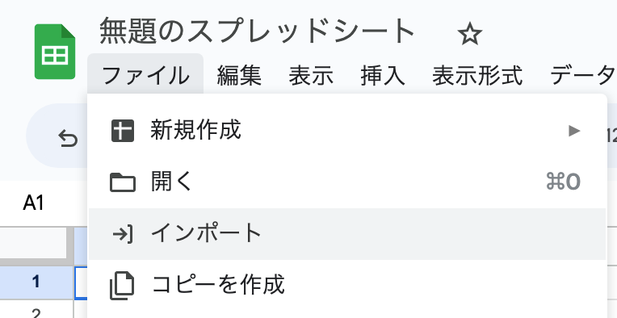
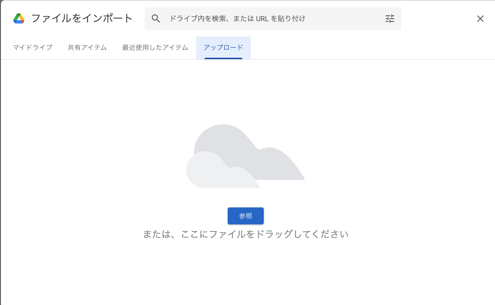
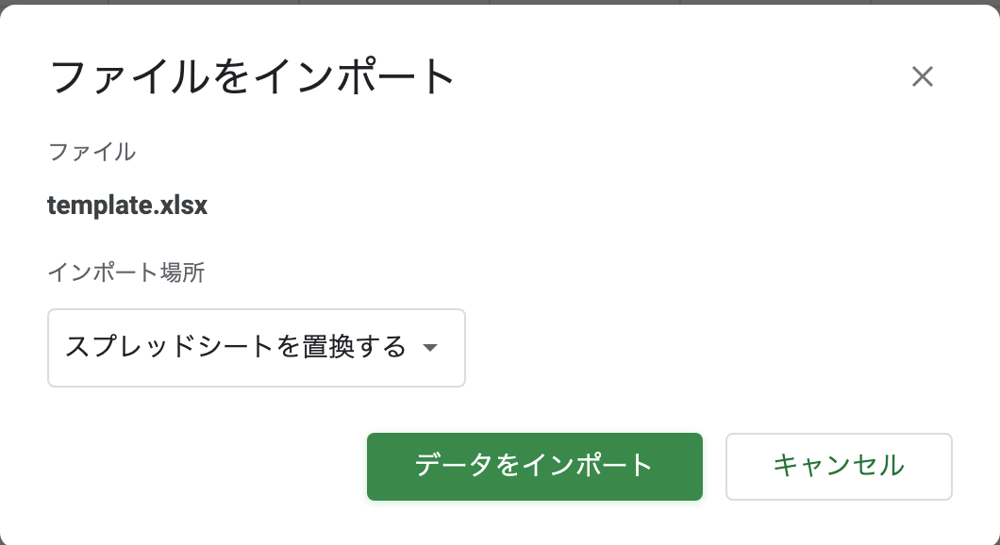

次に、「拡張機能」の「Apps Script」を選択し、先ほどダウンロードしたindex.jsの中身をコピーして貼り付けてください。最後に保存する必要があります。

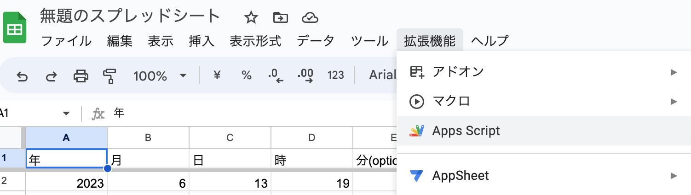
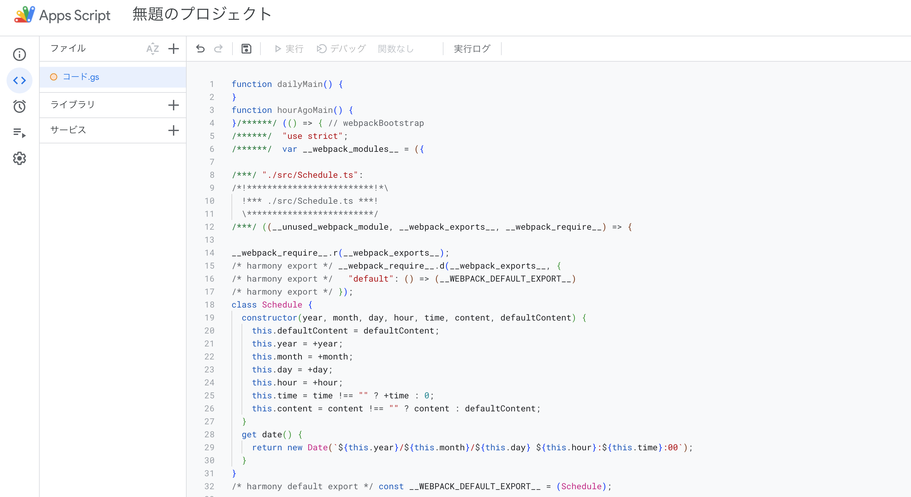

次にタイマーを設定していきます。スクリプトエディタの左側にある「トリガー」を選択してください。

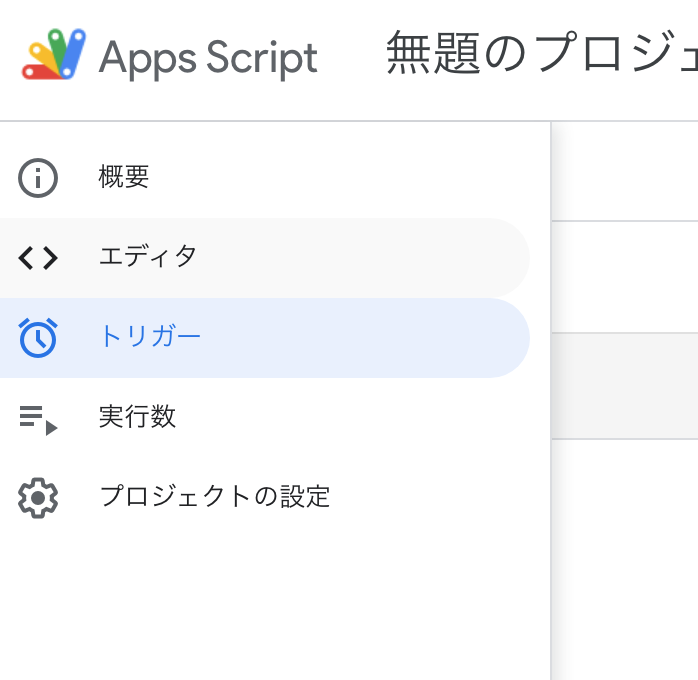

新しいトリガーを図のように設定してください。

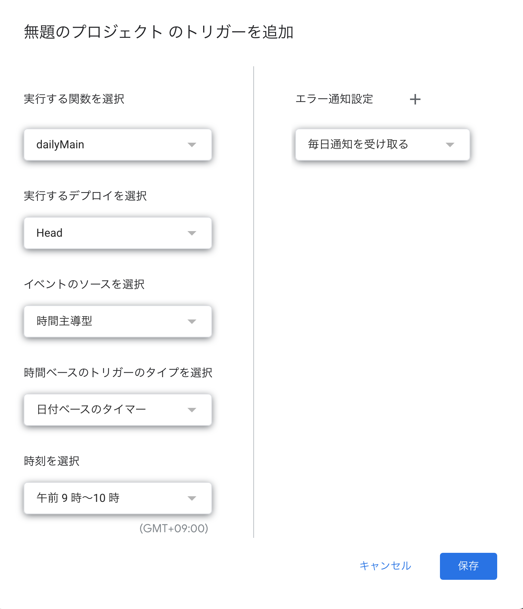

この時、警告が出ますがunsafeを承知した上で選択してください。

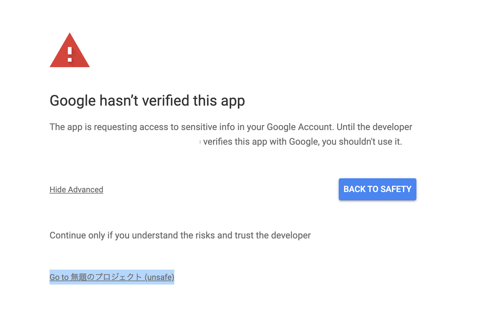

もう一つタイマーを設定します。

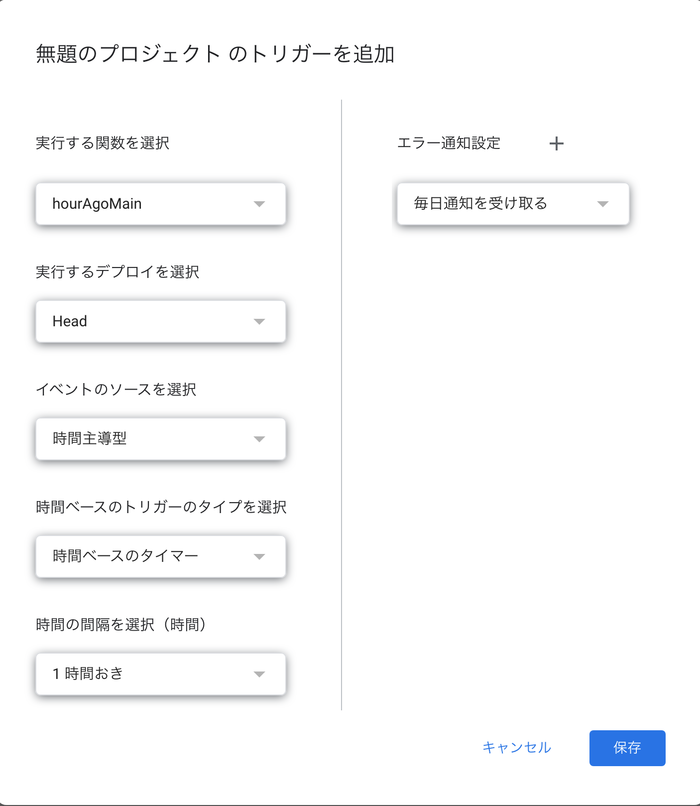

最終的にはこのようになります。

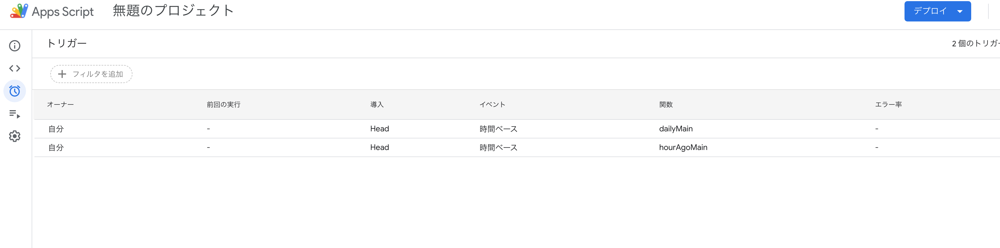

### Typetalkの設定

typetalkのトピックからトピックの設定を開き、ボットを作成してください。

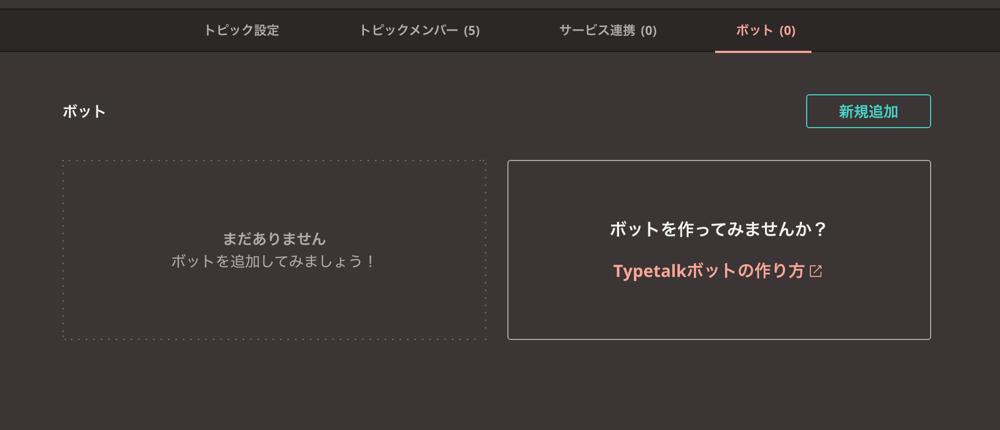

ボットIDとボット名を設定してください。

この時生成される、「Typetalk Token」とメッセージの取得と「投稿のURL」を保存しておいてください。

最後に、スプレッドシートの「config」シートの「TYPETALK_TOKEN」と「TYPETALK_URL」に先ほど保存した値を入力してください。

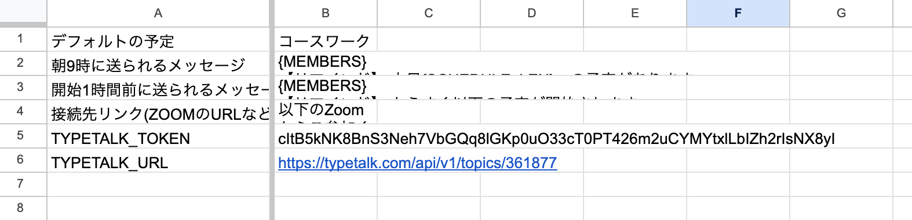

この時、zoomの接続先リンクやデフォルトの予定も変更しておくと良いです。

### 利用方法

まず、メンションを送りたい人のIDを「members」シートに追加してください。

そして、「schedule」シートで予定を追加してください。

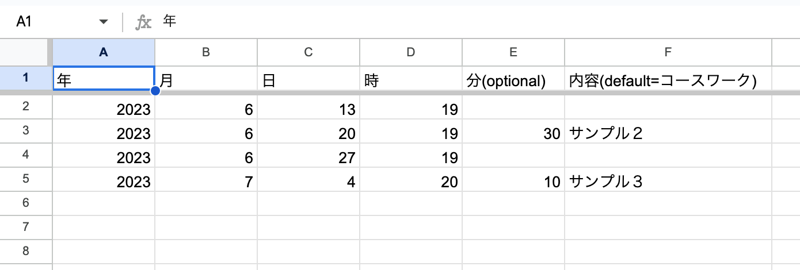